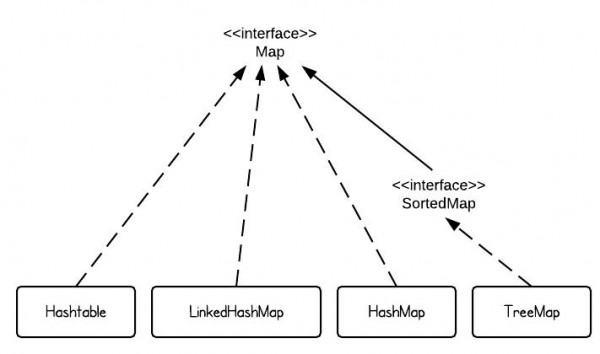

Comparision
- [ArrayList vs. LinkedList vs. Vector](#1arraylist-vs-linkedlist-vs-vectorhttpwwwprogramcreekcom201303arraylist-vs-linkedlist-vs-vector)
- [HashSet vs. TreeSet vs. LinkedHashSet](#2hashset-vs-treeset-vs-linkedhashsethttpwwwprogramcreekcom201303hashset-vs-treeset-vs-linkedhashset)
- [HashMap vs. TreeMap vs. Hashtable vs. LinkedHashMap](#3hashmap-vs-treemap-vs-hashtable-vs-linkedhashmaphttpwwwprogramcreekcom201303hashmap-vs-treemap-vs-hashtable-vs-linkedhashmap)

The major characteristics of the top level interfaces in Java Collections Framwork (under java.util)

|          |Duplicates?|Nulls?|Insertion Order|Implementations|
|----------|-----------|------|---------------|---------------|
|List      |Y|Y|Append at end or by specific position|ArrayList, LinkedList|
|Queue     |Y|N|FIFO|PriorityQueue, LinkedList, ArrayDeque|
|Deque     |Y|N|FIFO like a queue, or LIFO like a stack|ArrayDeque, LinkedList|
|Set       |N|At most one|Dependent|HashSet, LinkedHashSet, TreeSet|
|Map       |N(Keys),Y(Values)|Y(Key, null<=1), Y(Value)|Dependent|HashMap, LinkedHashMap, TreeMap|

### ArrayList
+ Implemented by array
+ Advantage
    - Randomly access(get and set) is constant time
+ Disadvantage
    - Modification(add and remove) is expensive, except changes are at end of arraylist
    - Search is inefficient
+ Complexity
    - Randomly access(get and set): O(1)
    - Insertion(add to front) and removal: O(n)

### LinkedList
+ Implemented by list of nodes
+ Advantage
    - Modification(add and remove) is constant time, when position if known
+ Disadvantage
    - Randomly access(add and set) is expensive
    - Search is inefficient
    - Indexable is not easy
+ Complexity
    - Randomly access(get, set): O(n)
    - Add, remove: O(1)

### Stack
+ FILO: operation is all in top of stack. (push and pop)
+ Could be implemented by LinkedList, ArrayList
    - List: push to front of list, pop is remove front node of list
    - Array: use a pointer top(initilized as -1), push is arr[++top], pop is arr[top--]  (use top==-1 to check is empty)
+ Complexity
    - Push: O(1)
    - Pop: O(1)
+ Application
    + Balance symbols
    + Postfix expression
    + Method calls

### Queue
+ FIFO: offer() is at end, poll() is at front
+ Could be implemented by DoubleLinkedList, array
    - List: Not finished
+ Complexity:
    - Enqueue: O(1)
    - Dequeue: O(1)

### Set
+ A collection of non-duplicate values
+ Application
    - TreeSet(Sorted Set): value is sorted. Worst time O(logN)

###Map
+ A collection of entries, entry is Key-Value pair.
+ Key is unique, value could duplicate
+ Map itself doesn't provide iterator, but could iterate through Key Set/Value Set/Entry Set's iterator
+ Application
    - TreeMap(Sorted Map): keep keys in sorted order


### HashTable/[HashMap](http://www.cnblogs.com/skywang12345/p/3310835.html)

##### Overview
+ Perform **insert, delete, search in average O(1)**
+ Print in sorted order in O(n) not supported
+ Load factor: ratio of # of elements in hash table to table size

##### Hash Function
+ Determinism: given same input, always generate same hash code
+ Uniformity: map inputs as evenly as possible over its output range
+ Defined range: desirable that outputs has fixed size
+ Continuity: two inputs differing a little should be mapped to nearly equal hash values
+ Non-invertible: impossible to reconstruct input from hash code

##### Collision
+ Different input map to the same hash code
+ Solution: **Separate Chaining HashTable(keep a list of elements that hash to same hashcode)**
    - insert: first check if list exists based on hashcode, if exist, insert into the front of the list; if not, create a new list. If element exists in list, we do nothing.(Why insert into front? Because recently inserted elements are more likely to be used in the near future.)
    - search: first determine which list to traverse according to hashcode, then search the list.
    - disadvantage:
        - using linkedlist
        - slow down time to allocate new cells
        - require implementation of another data structure
    - In Java API, HashSet and HashMap are separate chaining.
+ Solution: **Probing HashTable (probing next place to get an empty space)**
    - hash function: h_i(x) = (hash(x) + f(i)) % TABLE_SIZE, f(0) = 0
    - Disadvantage: primary clustering. As long as table is large enough, a free cell can always be found but might take a long time; when table is relatively empty, blocks of occupied cells start forming.
    - insert and unsuccessful search require the same number of probes
    - on average, successful search takes less time than unsuccessful search
+ Solution: **Quadratic Probing Hashtable (probing next quadratic place to get an empty space)**
    - f(i) = i^2
    - eliminate the primary clustering
    - no guarantee finding free cell when table gets more than half full or even before if table size is not prime because at most half of the table can be used as alternative locations to resolve collisions
    - table size must be prime, otherwise insertion might fail
    - secondary clustering
+ Solution: **Double hashing**
    - f(i) = i*hash_2(x)

##### Rehash
+ When # of elements in hash table beyond load factor, we enlarge hash table (mostly to the twice size)
+ Solution: build another table with *twice size*, copy elements to new table

##### Binary Search Tree vs. HashTable
+ Both can insert and contains operation
+ BST can getMin() quickly, HashTable cannot (HashTable not support order related operation)
+ BST can get elements in a range, HashTable cannot
+ Search Time: BST O(logN), HashTable O(1)

### PriorityQueue(Heap)

##### Overview
+ Heap is a complete binary tree(completely filled except bottom level)
+ average height: O(logN)
+ implement by an `array`, for element in array index i
    - Left child: 2i
    - Right child: 2i + 1
    - Parent: floor((i-1)/2)
+ time complexity
    - enqueing and dequeing methods (offer, poll, remove() and add): average `O(logN)`, worst `O(logN)`
    - remove(Object) and contains(Object): O(1)
    - retrieval methods (peek, element, and size): O(1)

##### Property
+ Smallest element at root(Min Heap) or largest at root(Max Heap)
+ min Heap: parent <= two children; max Heap: parent >= two children
+ findMin() in Min Heap is O(1)

##### Operations
+ insert()
    - create a hole in next available position, if order not violated, done; Otherwise, heapify up
    - time: O(logN)
+ deleteMin()
    - find minimum is easy
    - removing minimum will create a hole in the root, we must move last element X in the heap to correct position
    - put X in correct spot along a path from the root containing minimum children(heapify down)
    - time: worst O(logN), average O(logN)
+ decreaseKey()
    - lowers the value of item at position p by positive amount
    - if violate order, heapify up
    - application: make something higher priority
+ increaseKey()
    - increase the value of item at position p by positive amount
    - if violoate order property, heapify down
    - application: scheduler drops the priority of a process that is consuming excessive CPU time
+  delete()
    - remove node at position p
    - first perform decreaseKey(p, infinity) then perform deleteMin()
    - application: process terminated by user
+ buildHeap()
    - done with N successive inserts
    - insert takes O(1) average, O(logN) worst
    - build takes O(N) average, O(NlogN) worst

##### Application: Kth smallest elements
+ Build a min heap, delete k times
+ Build heap O(N), delete min O(logN), so total O(N + klogN)


### Binary Tree
General Tree(From Java API-String)  
```Java
public class Tree<T> {
    private Node<T> root;

    public Tree(T rootData) {
        root = new Node<T>();
        root.data = rootData;
        root.children = new ArrayList<Node<T>>();
    }

    public static class Node<T> {
        private T data;
        private Node<T> parent;
        private List<Node<T>> children;
    }
}
```

Binary Tree Node  
```Java
class BinaryNode{
    Object element;
    BinaryNode left;
    BinaryNode right;
}
````

##### Overview
+ Average depth: O(sqrt(N)), worst depth: N-1

Binary Search Tree
##### Overview
+ Average depth: O(logN)
+ Values in left subtree <= root value
+ Values in right subtree >= root value
+ Time: O(logN)

About the Tree:  
Full binary tree: a binary tree in which each node, except leaf, has two children.  
Complete binary tree: a binary tree in which every level is complete, except the last level. All nodes are as left as possible.  
AVL Trees: AVL trees are self-balancing binary search trees.  

The height of a node is the length of the longest downward path from that node to a leaf. The height of root is the height of the tree.   
The depth of a node is the length of the path to its root (i.e., its root path).  


# Comparison

### 1.[ArrayList vs. LinkedList vs. Vector](http://www.programcreek.com/2013/03/arraylist-vs-linkedlist-vs-vector/)

They all implement List interface. They are very similar to use. Their main difference is their implementation which causes different performance for different operations.

ArrayList is implemented as a **resizable array**. As more elements are added to ArrayList, its size is increased dynamically. It's elements can be accessed directly by using the get and set methods, since ArrayList is essentially an array.

LinkedList is implemented as a **double linked list**. Its performance on add and remove is better than Arraylist, but worse on get and set methods.

Vector is similar with ArrayList, but it is **synchronized**.

ArrayList is a better choice if your program is thread-safe. Vector and ArrayList require more space as more elements are added. Vector each time doubles its array size, while ArrayList grow 50% of its size each time. 

LinkedList, however, also implements Queue interface which adds more methods than ArrayList and Vector, such as offer(), peek(), poll(), etc.

Note: The default initial capacity of an ArrayList is pretty small. It is a good habit to construct the ArrayList with a higher initial capacity. This can avoid the resizing cost.

####Performance

|   |ArrayList|LinkedList|
|---|--------|----------|
|get()|O(1)|O(n)|
|add()|O(1)|O(1) amortized|
|remove()|O(n)|O(n)|

+ ArrayList has O(n) time complexity for arbitrary indices of remove, but O(1) for operation at the end of list(get/add)

+ LinkedList has O(n) time complexity for arbitrary indices of add/remove, but O(1) for operation at end/beginning of list(add)


Difference of performance is obvious. LinkedList is faster in add and remove, but slower in get. In brief, LinkedList is preferred if:
+ there are no large number of random access of element
+ there are a large number of add/remove operations

### 2.[HashSet vs. TreeSet vs. LinkedHashSet](http://www.programcreek.com/2013/03/hashset-vs-treeset-vs-linkedhashset/)

A Set contains no duplicate elements.

When to use HashSet or TreeSet?
+ if you need a fast set, you should use HashSet
+ if you need a sorted set, then TreeSet should be used
+ if you need a set that can be store the insertion order, LinkedHashSet should be used.

HashSet is implemented by a hashtable. Elements are not ordered. The add, remove, and contains methods have constant time complexity O(1).

TreeSet is implemented using a tree structure(red-black tree in algorithm book). The elements in a set are sorted, but the add, remove, and contains methods has time complexity of O(log (n)). It offers several methods to deal with the ordered set like first(), last(), headSet(), tailSet(), etc.

LinkedHashSet is between HashSet and TreeSet. It is implemented as a hash table with a linked list running through it, so it provides the order of insertion. The time complexity of basic methods is O(1).


TreeSet is much slower because it is sorted.

### 3.[HashMap vs. TreeMap vs. Hashtable vs. LinkedHashMap](http://www.programcreek.com/2013/03/hashmap-vs-treemap-vs-hashtable-vs-linkedhashmap/)


+ HashMap
    - implemented as a hash table
    - no ordering on keys or values
+ TreeMap
    - implemented based on red-black tree structure
    - ordered by the key
+ LinkedHashMap
    - preserves the insertion order
+ Hashtable
    - synchronized (in contrast to HashMap)

The HashMap API is similar to Hashtable, difference:
+ HashMap is unsynchronized and not thread-safe, HashTable is synchronized and thread-safe.
+ HashMap allows one null keys and null values; HashTable not allow null keys and null values.
+ HashMap is much faster and use less memory than HashTable. (Unsynchronized objects are often much better in performance in compare to synchronized objects in single thread environment.)

When to use HashMap and Hashtable?
+ HashMap is preferred in unsynchronized or single threaded environment.
+ HashTable is preferred in multi-thread environment.

TreeMap is 
+ implemented by Red-Black tree
+ sorted according to the order of keys
+ guaranteed log(n) time cost for the containsKey(), get(), put() and remove()
+ Not synchronized


###Reference
1. [Java Collections Framework summary table](http://www.codejava.net/java-core/collections/java-collections-framework-summary-table)
2. [How to Check if an Array Contains a Value in Java Efficiently?](http://www.programcreek.com/2014/04/check-if-array-contains-a-value-java/)
3. [Big O Cheat Sheet](http://www.bigocheatsheet.com/)