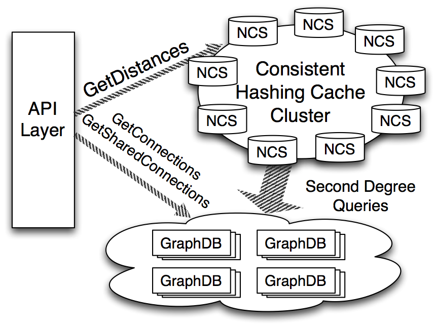

How to check friend, and friend of friend (2nd degree friend), and friend of friend of friend (3rd degree friend)? 
You are given a get_friends_lists() API, return a ascending sorted list of 1st degree friends.

Follow-up: how to improve efficiency of shared data?

## Requirement

#### Functional Requirement

#### Non-Functional Requirement

## Analysis

Friendship relationship in social network is the graph distance problem. 

We store **1st degree** relationship in a KV database (with replica and properly sharding).  
**2nd degree** relationship: Using a common BFS to get the 2nd degree relationship. Time `O(n^2)`  
**3rd degree** relationship: Using the 2nd degree relationship and the 1st degree relationship of the 2nd degree friends to merge them and get 3rd degree friends.  

#### Total Users & DAU

#### Write TPS

#### Read TPS

#### Storage

#### Network

#### Cache

## API Design

```
getConnections()  -  sorted list of 1st degree friends. I think it's O(1) Time Complexity.
```

```
getSharedConnection(X, Y)  - get the sorted connection list of X, Y, and do intersection, and return result. Time: O(N) by doing the intersection of X, and Y's connection list.
```

```
getDistance(X, Y)    -  input is source member ID and a set of destination member IDs, then returns the network distance between the source to destination up to 3 degrees. Using BFS will be O(N^2) Time complexity.
```

## Database Design

## High Level Design




* **GraphDB**: a KV database storing edges in the graph. It is horizontally scaled up, so that one member's entire adjacency list is stored in one physical node. It also has replicas.
* **Network Cache Service (NCS)**: a consistent hashing cache to store 2nd degree friends. It communicates with GraphDB to calculate 2nd degree distances. 80% of 2nd degree calls could be cached in the NCS.
* **API layer**: entry point for clients.

Example of `getDistance(X, Y)`: we want to get the distance of X and Y. We found get the 2nd degree list of X in the NCS, and check if Y is in the list. If Yes, then Y is 2nd degree. If not, we do a `getConnect(Y)` list, and use Y's 1st degree list to intersect X's 2nd degree list. If there is intersection, which mean Y is X's 3rd degree friend. If no intersection, which means they are not friends. (We don't consider relationship > 3 layers here).


As 80% of the 2nd degree could be retrieved in NCS, the tough part is calculate the 20% 2nd degree cache miss case in highly scale and low latency. What we can do is retrieve 1st degree friend list of the member, and the 2nd degree friends are gathered from each node, and we do merge in the GraphDB host in parallel. 

Here is a trade-off, we could do merge and deduplicate in either NCS or GraphDB host. If we do it in NCS, it will consume a lot of Network Bandwidth, and CPU resources. If we do it in GraphDB, it will consume less Bandwidth, and the same amount of CPU.

As the merging list is consuming a lot of CPU resources, we have to find a efficient way to find out the smallest subsets to cover the maximum number of uncovered points in a large set. We use an algothrim called **Greedy Set Cover algorithm**.

#### GraphDB Partitioning and Replication
We use `partition_id = hash(member_id)` to calculate the partition_id, which is used to determine which GraphDB node to store the member's 1st degree relationship. And the each member's 1st degree friends are sorted by ID and stored in one single GraphDB.

Each partition node is replicated on R different machines (R could be 3). Each physical machine could hold P partitions (to save physical machine resources). If N is total number of members, the # of machines is: `Z = (N * R) / P`.

To prevent Hot Partition, if two partitions are stored on the same machine in one replica, they will be stored on different machines in other replicas.


#### Greedy Set Cover algorithm
https://www.geeksforgeeks.org/set-cover-problem-set-1-greedy-approximate-algorithm/

Example:
```
   U = {1,2,3,4,5}
   S = {S1,S2,S3}
   
   S1 = {4,1,3},    Cost(S1) = 5
   S2 = {2,5},      Cost(S2) = 10
   S3 = {1,4,3,2},  Cost(S3) = 3

Output: Minimum cost of set cover is 13 and 
        set cover is {S2, S3}

There are two possible set covers {S1, S2} with cost 15
and {S2, S3} with cost 13.
```

Algorithm: 
```
1) Let I represents set of elements included so far.  Initialize I = {}

2) Do following while I is not same as U.
    a) Find the set Si in {S1, S2, ... Sm} whose cost effectiveness is 
       smallest, i.e., the ratio of cost C(Si) and number of newly added 
       elements is minimum. 
       Basically we pick the set for which following value is minimum.
           Cost(Si) / |Si - I|
    b) Add elements of above picked Si to I, i.e.,  I = I U Si
```

Example: 
Let us consider the above example to understand Greedy Algorithm.

First Iteration:
I = {}

The per new element cost for S1 = Cost(S1)/|S1 – I| = 5/3

The per new element cost for S2 = Cost(S2)/|S2 – I| = 10/2

The per new element cost for S3 = Cost(S3)/|S3 – I| = 3/4

Since S3 has minimum value S3 is added, I becomes {1,4,3,2}.

Second Iteration:
I = {1,4,3,2}

The per new element cost for S1 = Cost(S1)/|S1 – I| = 5/0
Note that S1 doesn’t add any new element to I.

The per new element cost for S2 = Cost(S2)/|S2 – I| = 10/1
Note that S2 adds only 5 to I.

The greedy algorithm provides the optimal solution for above example, but it may not provide optimal solution all the time.

## Detailed Design

#### Write Path

#### Read Path


## Reference
* https://engineering.linkedin.com/real-time-distributed-graph/using-set-cover-algorithm-optimize-query-latency-large-scale-distributed
* http://0b4af6cdc2f0c5998459-c0245c5c937c5dedcca3f1764ecc9b2f.r43.cf2.rackcdn.com/11567-hotcloud13-wang.pdf
