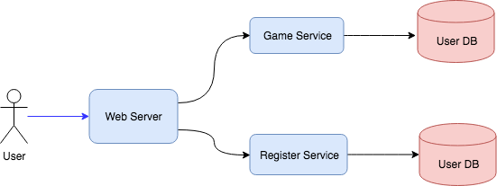
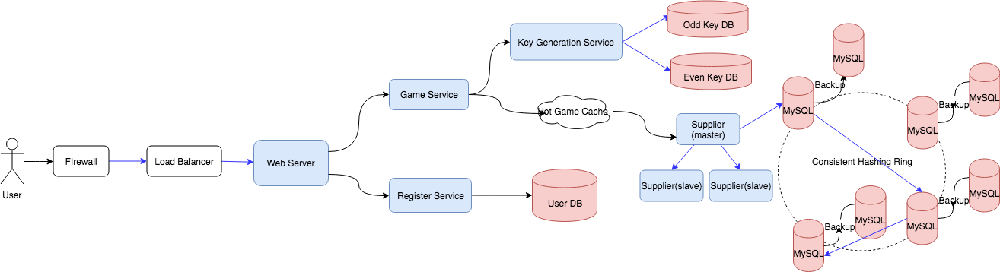

Design a scalable server for the hangman game
Requirement: 1. User could earn money or lose money; 2. User increases from 0 to 5M (so the design should be scalable)

It should be Client-Server Web Application, client plays in the Browser, and server do the judgement in the backend. We cannot let the judgement code logic run in client side, as customer could view the result in the source code of the web page.

For a Web Application design, it should cover front-end, back-end, database. 

## Requirement

Clarification of the game:
* Is the game a multi-player game or a human against computer game? Human against computer game.
* Do we need persist the status of the game, e.g. after user logout, the user could login again to continue playing, or it's a stateless game? Should persist the status in DB.
* What's the policy of earning or losing money? Let's simplify the policy, just win one game earn 1 dollar, lose one game lose  1 dollar. Later we could define the difficulty level to determine how much user will earn or lose.

#### Functional Requirement
1. Initialize the game. Server generates a random word from dictionary, and return mask word (e.g. if word is "banana", mask word returned to customer is "_ _ _ _ _ _").
2. User play the game. Server judge the customer's guessed character, and return updated mask word if the guessed character is included in the word.
3. Multi-users. Users could login, register, and earn/lose money.

#### Non-Functional Requirement
1. Highly Available. The down time percentage is low.
2. Highly scalable. Could handle as much as 500M+ users play concurrently.

## Analysis

#### Total Users & DAU
Total Users: 500M  
DAU: 100M  

#### Write TPS
Assume each active user play 10 games, and each game will write the scores/money into the DB in the end.
TPS: 100M * 10 / 86400 = 10K TPS

#### Read TPS
Assume each active user play 10 games, each game could guess at most 10 times, and on average 8 times.
TPS: 100M * 10 * 8 / 86400 = 80K TPS

#### Storage
User Table: 500M * 300 bytes = 150 GB  
It increases by 20% per year. So one year, it will increase to 200 GB next year. For 10 years, it will be about 2 TiB. So a single host is not enough, we have to do horizontal scale up the table (sharding).

Game Table: 100M * 10 * 200 bytes = 200 GB per day
200 GB * 365 = 73 TB  
We have to horizontal scale up the DB.

#### Network
Assume each one request size is 10 bytes.

Throughput: 100M * 10 * 100 bytes / 86400 = 1 Mbps

#### Cache
Cache 10% of hot users result into the cache.

## API Design
```
start_game(user_id)
```

```
play_game(user_id, game_id, guessed_char)
```

## Database Design

User Table
```
PK  | user_id:int
    | nickname: varchar(30)
    | money: int
    | games_played: int
```

Game Table
```
PK  | game_id: int
FK  | user_id: int
    | isCompleted: boolean
    | result: boolean
    | word: varchar
    | mask: varchar
    | money_earn: int
```

## High Level Design


## Detailed Design


#### Write Path

#### Read Path


