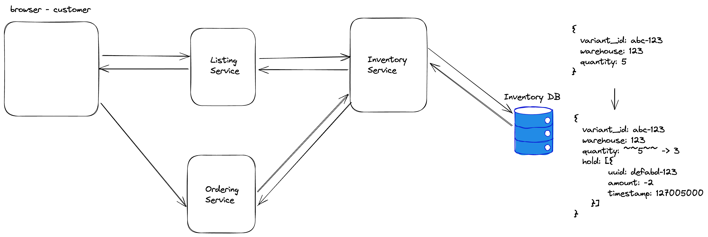

Inventory Design

## Requirement

#### Functional Requirement
1. show available items
2. track the inventory, as it changes
3. Inventory changes may occur in **distributed transaction** performed by other services
    a. Expose an interface for these distributed transactions
4. Inventory snapshots and auditing

#### Non-Functional Requirement
1. ordering itself (handle orders and payments)
2. payments
3. listings and location look-up

#### Call Outs
1. thread contention (prime day lightning deals)
2. large objects issue if too many "holds" get placed
3. large carts (huge amount of items in one cart)

## Analysis

Some numbers:
- 3.0B "visits" in one month and 10 pages views per visit
- 300M items were sold over the course of 2 days for prime day 2022

Less important numbers:
- 300M regular customer accounts
- 200M prime accounts
- 12M items from AFN itself
- 350M items when considering 3rd party sellers
- 175 global fulfillment centers
- 10M 3rd party sellers

#### Total Users & DAU
- Users: 200M
- DAU: assume 50%, so 100M

#### Write TPS
300M items were sold in 2 days
300M / 2 = 150M items sold in 1 day
150M / 86400 = 1.7K items sold/s = 102K CPM (checkout per minute)

#### Read TPS
3.0B visits * 10 page views/visit = 30B page views in one month
30B / 30 = 1B reads per day

1B / 86400 ~= 11K reads/s

#### Storage
Inventory DB can be Dynamo DB which provides:
1. Strong Consistency on the transaction
2. Good write heavy throughputs

Cassandra is good for read heavy throughputs.

#### Network

#### Cache

## API Design

## Database Design

## High Level Design

## Detailed Design

#### Write Path

#### Read Path

Two phases commit:
1. Place a hold on the item
request:
    item_id: abc-123
    quantity: 2
Response:
    id (some kind of uuid): defabd-123

2. "execute" the hold (async)
Request:
    uuid: defabd-123
Response:
    200

* Start from a single DB so easier for the transaction.
* Reservation: Add variant to cart does not require strong consistency, but requires high availability.
* writes are high volume, so it's better to use Kafka, and make it asynchronously. For example, tell clients they bought the items, but the orders haven't been executed until the task runners finish executing the events. It could take up to 24 hours. (Similar to Shopify's checkout queue.)
* Event Sourcing DB: which can be used for audit, and rebuilding the Inventory DB. Update the event sourcing DB first before execute the second phase

Follow-up 1: What if there are large amount of holds?
1. The holds records can go to a separate DB
2. With 2 DB (one for Inventory, one for Holds), we have to have a distributed transactions for the Phase 1 operations.

Follow-up 2: What if the thread contention (prime day lightning deals)?
1. transactions may block each other, some of them will timeout
2. sharding the Inventory DB by variant_id (in reality, we shard by shop_id)

## Reference
1. https://www.youtube.com/watch?v=uH163go3pvQ
2. https://medium.com/walmartglobaltech/design-inventory-availability-system-using-event-sourcing-1d0f022e399f

