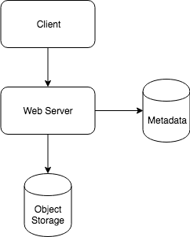

Pastebin is a service enable users to store plain text or images over the network, and generate unique URLs to access the uploaded data.


## Requirements

#### Functional Requirements
1. User could "paste" their data, and get a unique URL to access it.
2. User could upload the text.
3. Data and links will expire automatically, and user could specify the expiration time.
4. User should optionally be able to pick a custom alias for their pate.

#### Non-Functional Requirements
1. Highly reliable, which means the data should not be lost.
2. High available. Percentage of time to be down should be low.
3. Efficiency. Low latency and high throughput.

#### Extended Requirements
1. Analytics. How many times a paste was accessed?
2. Provide RESTful API for otherr services.

## Design Consideration

1. Size limitation? We can limit the 'paste' data size less than 10 MB to stop abusing the service.
2. Should we support customized URL? Size limitation of the customized URL? Limitation of customized URL could be 6 bytes.

## Analysis

#### Daily Active User

DAU: 100 Million

#### Write TPS

Assume each user will write one paste bin.

Total pastes write in one day: 100M * 1 = 100M

Avg TPS: 100M * 1 / 86400 = 1K TPS

Peak is 3 times: 3K TPS

#### Read TPS

Assume each user will read 10 paste bin.

Total pastes read in one day: 100M * 10 = 1B

Avg TPS: 100M * 10 / 86400 = 10K TPS

Peak is 3 times of avg TPS: 30K TPS

#### Storage

The paste bin size limitation is 10 MB, we assume the average paste size is 10 KB, total size generated in one dayy is

100M * 10KB = 1B KB = 1M MB = 1K GiB = 1 TiB / day

We need 400 TiB storage in one year. 

As the URL size limitation is 6 bytes, if we use base64 encoding (A-Z, a-z, 0-9, ., -), we could totally have the base64 encoding space to be:

64^6 ~= 68.7 Billion unique strings

If it takes one byte to store one character, total size required to store the unique URLs is:

100M * 6 bytes = 600M bytes = 600K KB = 600 MiB / day

#### Network

Write throughput: 1K TPS * 10 KB = 10K Kbps = 10 Mbps

Read throughput: 10K TPS & 10 KB = 100K Kbps = 100 Mbps

#### Caching

Assume we store 20% of the whole traffic in memory, we should need:

2% * 1B * 10 KB = 200M KB = 200K MB = 200 GiB

## API Design

Write API: 
```
writePaste(api_dev_key, paste_data, custom_url=None, user_name=None, paste_name=None, expire_date=None);
```

* api_dev_key: the identifier of the caller service. It could be used to throttle the users.
* paste_data: self-explained as the data of the paste, size limitation is 10 KB
* custome_url: self-explained, size limitation is 6 bytes
* user_name: self-explained
* paste_name: the title or name of the paste, default is None
* expire_date: optional expiration date for the paste, default is None

Read API: 
```
getPaste(api_dev_key, api_paste_key)
```

* api_paste_key: identifier of the paste

Delete API:
```
deletePaste(api_dev_key, api_paste_key)
```

## Database Design

A few observations about the nature of the data we are storing:
1. Store billions of records.
2. Paste metadata is small (less than 1 KB).
3. Paste data size is medium (avg 10 KB, maximum 10 MB)
4. Query structure is simple, no need transaction or complex query. No special relationship between records.
5. Read-heavy, write-light.

DB schema:

Paste table:

```
PK    |   url_hash: varchar(16)
      |   api_paste_key: varchar(512)
FK    |   api_dev_key: varchar(512)
      |   expiration_date: datetime
      |   creation_date: datetime
```

User table:

```
PK    |   api_dev_key: varchar(512)
      |   email: varchar(512)
      |   creation_date: datetime
      |   last_login_date: datetime
```

## High Level Design

Object storage: AWS S3  
Metadata storage: AWS RDS (MySQL)  
Web Server: AWS EC2  





## Component Design


