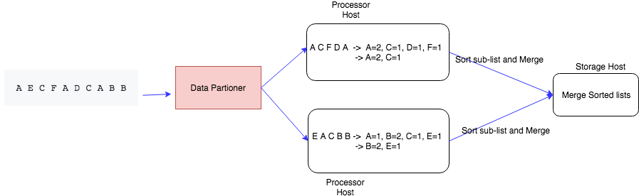
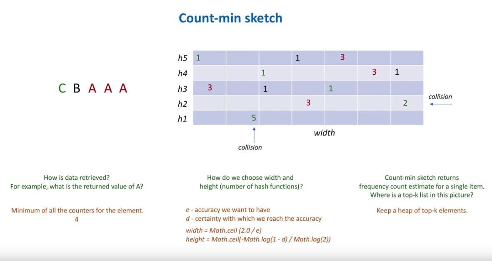

Design a system which returns the Top K heavy hitters. For example, find the 100 of the most searched keywords on google, the top 100 viewed videos on YouTube, 100 most played songs on Spotify, 100 most shares posts on Facebook, 100 most retweeted tweets on Twitter, 100 most liked photos on Instangram.

For these services, there are hundred of thousands of requests per second. We cannot use distributed cache or database to store the sorted data.

MapReduce is also not enough, as the requests are keep on going, the top 100 is updating very fast. And we need top 100 list for 1 minute, 5 minute, 15 minutes, 60 minutes.

## Requirement

#### Functional Requirement
1. Return the list of Top 100 shared links in the past 1 minute, 5 minutes, 15 minutes, 60 minutes.

#### Non-Functional Requirement
1. Scalable. It should be able to scale out together with increasing amount of data: videos, tweets, posts, etc.
2. Highly Available. It should be able to survive hardware/network failures, no single point of failure.
3. Highly Performant. few tens of milliseconds to return top 100 list.
4. Accurate: as accurate as we can get

## Analysis

#### Total Users & DAU

#### Write TPS

#### Read TPS

#### Storage

#### Network

#### Cache

## API Design

```
topK(k, start_time, end_time)
```
## Database Design

## High Level Design

A naive solution: 
Hashtable, singlehost

```
Input Data:
A B C A A D C A B C

Hashtable:
C: 3
D: 1
A: 4
B: 2

Use Heap:
Time: O(NlogK) - K is number of top K we required, N is total links
A: 4
C: 3

```
Single host solution is not scalable, and will become single point of failures.

A improved solution is to use multiple hosts to count frequency. It will be a huge hash table in memory.



Algorithms:
1. Randomly partitioning data into Processor Hosts.
2. Each Processor Host collect the data, and get the TopK list in the host, and sort the list.
3. Pass the sorted TopK list to the Storage Host, and do a K-way merge, to get the final TopK. Time: O(KlogK).

This approach will have better scalability and throughput. Drawbacks:
1. Data set could be streaming data, and no boundary (means infinite). 
2. We need per 1 minutes TopK, 5 minute TopK, or even 1 hour TopK, we cannot store all the state in the memory of Processor Host. (We can assume that the memory of Processor Host can only hold 1 minute's data).

## Detailed Design

Analysis of the problem:
1. We need the whole data set in the particular time period (e.g. one day). But one day dateset is too large to hold in memory of a single host. Solution to this problem: store the dataset in disk, and only process one chunk of data in memory, get TopK of the chunk, and finally merge the TopK of all chunks to get the final TopK. This is the MapReduce counting idea.
2. The complexity of the solution. Every time we introduce data partitioning, we need to deal with data replication, so data in each partition are stored in multiple nodes.

#### How to count the number of each element in the data stream? Count-min sketch



We use Count-min sketch to count the frequency of each element to avoid hash collision, and we maintain a TopK heap to get the TopK. So in memory, there is only Count-min sketch and a max heap.

#### Components:
* **Web Server**: the entry point for all clients, aggregate data on the fly or via a dedicated backend process that processes logs (if it's count TopK exception, we could have a backend process to collect exceptions in logs; if it's count TopK shared links, we could aggretate the shared links on the fly). It will have a buffer in memory which contains Count-min sketch and max heap. If the buffer is full, we will flush the buffer to disk; if we reach a specific time period (e.g. 1 minute), we flush the buffer to disk even though it's not full.
* **Distributed Messaging System**: could be Apache Kafka or AWS Kinesis, etc. It has random partitioning. Or we can define our own partition rule if we have any requirement about partitioning. 
* **Fast Path**: process data in a short period of time (e.g. within 1 minute, or 10 seconds), we should ensure the data aggregated into memory could fit into the RAM of a single host.
* **Slow Path**: process data with 15 minutes, 1 hr or even 1 day
* **Fast Processor**: create Count-min sketch and aggregate data for 1 minute. For one minute data, we could directly put in memory of single machine, we don't need data partitioning. Data replication is nice to have, but may not be strictly required.
* **Slow Processor**: 
* **Storage Host**: Every several seconds, flush data from Fast Processor into the storage host. The reason we flush every several seconds is because we don't want the result to be delayed for customer. It has a final count-min sketch, and has a Max Heap in buffer. Data replication is required to avoid data lose because of hardware issue. We could use SQL or NoSQL.

The reason we aggregate few seconds of data in the buffer of Web Server, and do Count-sketch, and MaxHeap, is because we want to decrease the number of data go to Kafka. So we are sure that the data in Fast Processor is much smaller than the data in Web Server. After the Fast Processor, there are only a small fraction of data in the Storage Host to process.

For the fast path, we dump the data in the distributed Messaging System into a distributed storage system, e.g. AWS S3 or HDFS. We run two MapReduce jobs: Frequency Count Job, TopK MapReduce Job. We store the TopK MapReduce Job result in the Storage Host.


#### Write Path

#### Read Path


## Reference
* https://www.youtube.com/watch?v=kx-XDoPjoHw
