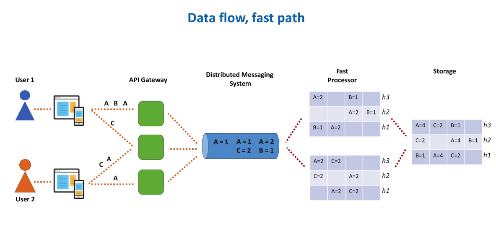
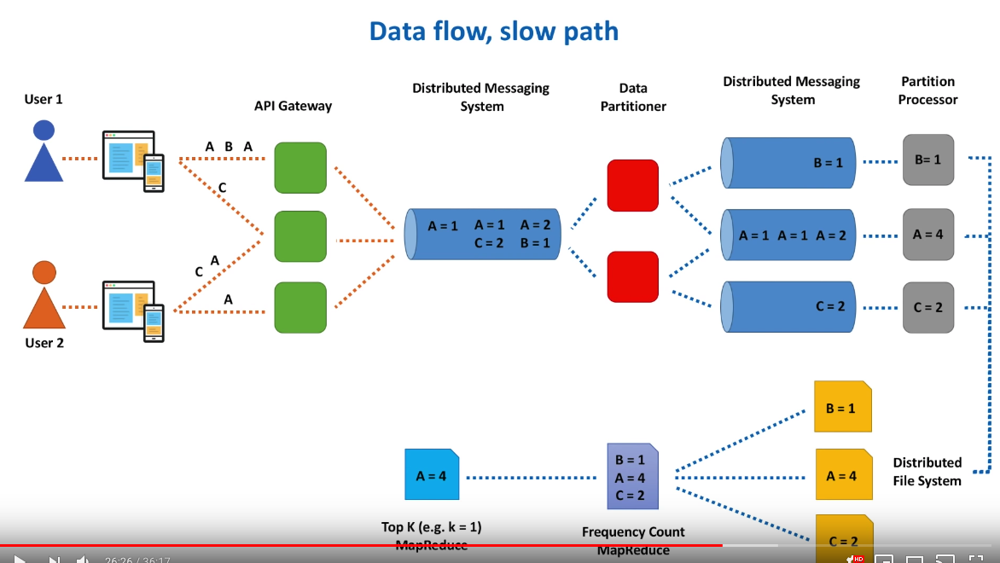
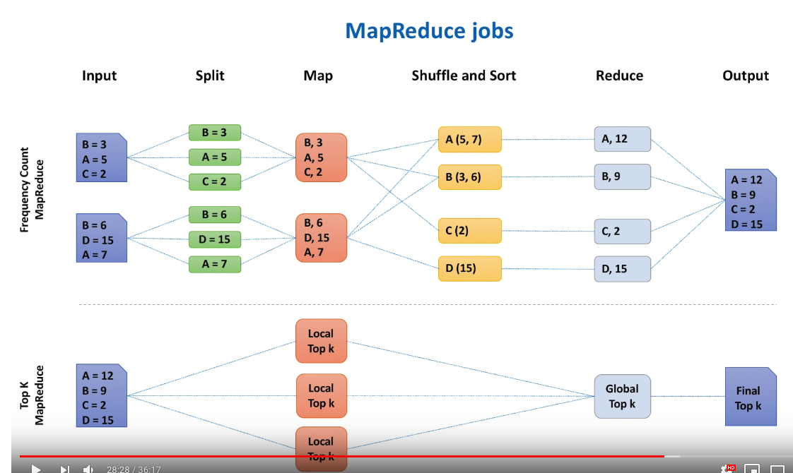

Design a system which returns the Top K heavy hitters. For example, find the 100 of the most searched keywords on google, the top 100 viewed videos on YouTube, 100 most played songs on Spotify, 100 most shares posts on Facebook, 100 most retweeted tweets on Twitter, 100 most liked photos on Instangram.

For these services, there are hundred of thousands of requests per second. We cannot use distributed cache or database to store the sorted data.

MapReduce is also not enough, as the requests are keep on going, the top 100 is updating very fast. And we need top 100 list for 1 minute, 5 minute, 15 minutes, 60 minutes.

## Requirement

Some questions could ask to define the problem?
1. How large is the data set? Infinite streaming data.
2. How accurate the system required? As accurate as possible, but we also need to have the result as fast as possible. So there is a balance between accuracy and speed.
3. Clarification about the output. Do we need the accurate number of counts or we just need the list of TopK shared links? We just need the TopK shared links, and don't need accurate number of counts of these TopK links.
4. The number K is a fixed K or variable K as parameter? Variable K.

#### Functional Requirement
1. Return the list of Top 100 shared links in the past 1 minute, 5 minutes, 15 minutes, 60 minutes.

#### Non-Functional Requirement
1. Scalable. It should be able to scale out together with increasing amount of data: videos, tweets, posts, etc.
2. Highly Available. It should be able to survive hardware/network failures, no single point of failure.
3. Highly Performant. few tens of milliseconds to return top 100 list.
4. Accurate: as accurate as we can get

## Analysis

#### Total Users & DAU

#### Write TPS

#### Read TPS

#### Storage

#### Network

#### Cache

## API Design

```
topK(k, start_time, end_time)
```
## Database Design

## High Level Design

#### A naive solution: Hashtable + Min Heap, in singlehost
Using Hashtable to store <key, frequency> pair, Max Heap to store TopK Keys.

```
Input Data:
A B C A A D C A B C

Hashtable:
C: 3
D: 1
A: 4
B: 2

Use Min Heap:
Time: O(NlogK) - K is number of top K we required, N is total links
A: 4
C: 3
```

Code: 
```
class HeavyHitter {
  provate final String identifier;
  private final int frequency;
  
  public HeavyHitter (String identifier, int frequency) {
    this.identifier = identifier;
    this.frequency = frequency;
  }
}

public List<HeavyHitter> topK(String[] events, int k) {
  Map<String, Integer> frequencyTable = new HashMap<>();
  for (String e : events) {
    frequencyTable.put(e, frequencyTable.getOrDefault(e, 0) + 1);
  }
  
  PriorityQueue<HeavyHitter> heap = new PriorityQueue<>(Comparator.comparing(e -> e.getFrequency()));
  
  for (Map.Entry<String, Integer> e : frequencyTable.entrySet()) {
    heap.offer(new HeavyHitter(e.getKey(), e.getValue()));
    if (heap.size() > k) {
      heap.poll();
    }
  }
  
  List<HeavyHitter> res = new ArrayList<>();
  while (heap.size() > 0) {
    res.add(heap.poll());
  }
}
```

Pros: 
* Easy

Cons:
* Single host solution is not scalable
* Have single point of failures.

#### An improved solution: use multiple hosts to count frequency, and Min Heap to get TopK
It will be a huge hash table in memory of processor host.


Algorithms:
1. Randomly partitioning data into Processor Hosts.
2. Each Processor Host collect the data, and get the TopK list in the host, and sort the list.
3. Pass the sorted TopK list to the Storage Host, and do a K-way merge, to get the final TopK. Time: O(KlogK).


Pros:
* Better scalability and throughput comparing to the single host solution

Cons:
1. This solution is useful when data is bounded, and could be paritioned to small chunks to fit into the RAM of a single host. But the real data set could be streaming data, and no boundary (means infinite). We need per 1 minutes TopK, 5 minute TopK, or even 1 hour TopK, we cannot store all the state in the memory of Processor Host. (We can assume that the memory of Processor Host can only hold 1 minute's data). If we want the data in 1 hour, then this solution doesn't work. 
2. Time period is one thing, how large is number K is another thing. As K is variable, and could be very large, and cannot fix into the RAM of one host.

## Detailed Design

Analysis of the problem:
1. We need the whole data set in the particular time period (e.g. one day). But one day dateset is too large to hold in memory of a single host. Solution to this problem: store the dataset in disk, and only process one chunk of data in memory, get TopK of the chunk, and finally merge the TopK of all chunks to get the final TopK. This is the MapReduce counting idea.
2. The complexity of the solution. Every time we introduce data partitioning, we need to deal with data replication, so data in each partition are stored in multiple nodes.

#### How to count the number of each element in the data stream? Count-min sketch


#### Why we need multiple hash function rather than single hash function?
* Reduce hash collision to improve the accuracy of counting

#### How is data retrieved? For example, what is the returned value of A in the above Count-min stretch?
Find the minimum of all the counters for the element, and return it as final authorative result. For the value A, the result is 3.

#### How do we choose width (length of hash space) and heighth (# of hash function) in the Count-min sketch?

```
e - accuracy we want to have
d - probability with which we get the the exact accurate counting

width = Math.ceil(2.0/e)
height = Math.ceil(-Math.log(1-d) / Math.log(2))
```

We use Count-min sketch to count the frequency of each element to avoid hash collision, and we maintain a TopK heap to get the TopK. So in memory, there is only Count-min sketch and a Min Heap.

#### Components:
* **Web Server**: the entry point for all clients, aggregate data on the fly or via a dedicated backend process that processes logs (if it's count TopK exception, we could have a backend process to collect exceptions in logs; if it's count TopK shared links, we could aggretate the shared links on the fly). It will have a buffer in memory which contains Count-min sketch and max heap. If the buffer is full, we will flush the buffer to disk; if we reach a specific time period (e.g. 1 minute), we flush the buffer to disk even though it's not full.
* **Distributed Messaging System**: could be Apache Kafka or AWS Kinesis, etc. It has random partitioning. Or we can define our own partition rule if we have any requirement about partitioning. 
* **Fast Path**: process data in a short period of time (e.g. within 1 minute, or 10 seconds), we should ensure the data aggregated into memory could fit into the RAM of a single host.
* **Slow Path**: process data with 15 minutes, 1 hr or even 1 day
* **Fast Processor**: create Count-min sketch and aggregate data for 1 minute. For one minute data, we could directly put in memory of single machine, we don't need data partitioning. Data replication is nice to have, but may not be strictly required.
* **Slow Processor**: 
* **Storage Host**: Every several seconds, flush data from Fast Processor into the storage host. The reason we flush every several seconds is because we don't want the result to be delayed for customer. It has a final count-min sketch, and has a Max Heap in buffer. Data replication is required to avoid data lose because of hardware issue. We could use SQL or NoSQL.

The reason we aggregate few seconds of data in the buffer of Web Server, and do Count-sketch, and MaxHeap, is because we want to decrease the number of data go to Kafka. So we are sure that the data in Fast Processor is much smaller than the data in Web Server. After the Fast Processor, there are only a small fraction of data in the Storage Host to process.

For the fast path, we dump the data in the distributed Messaging System into a distributed storage system, e.g. AWS S3 or HDFS. We run two MapReduce jobs: Frequency Count Job, TopK MapReduce Job. We store the TopK MapReduce Job result in the Storage Host.

* **Data Partitioner**: 1). Parse batches of events into individual events. 2). Hash Partitioning (e.g. Video Identifier + time window). 3). Deals with hot partitions.

Then put each partition of data (a subset of data) into each Kafka topic. Kafka will take care of the replication. 

* **Partition Processor**: Aggregate one partition data in memory over the time window of several minutes, and process the data in one partition using the Two MapReduce Job mentioned above.

#### Discussion about the fast processor and slow processor

If the accuracy is not important, we could just use the fast process, which is easy to implement. And we could merge the result of several seconds into large time window, e.g. one hour. But the One hour result is not accurage.

If we need accurate ressult for one hour, we have to use Hadoop to process the data.

#### The first step is aggregate the data in the API Gateway. What if we are processing the TopK exceptions, but the API Gateway host doesn't have enough CPU or memory to process the logs?

As we are finally send the logs to a dedicated storage host. We could process the logs in a dedicated cluster.

#### Any alternativee to Count-min sketch?

We could use Lossy Counting Algorithm, Space Saving Algorithm to replace Count-min Sketch.
https://soulmachine.gitbooks.io/system-design/cn/bigdata/heavy-hitters.html

#### How big is the K?

#### What is the drawbacks of this architecture?


#### Fast Path


#### Slow Path


#### MapReduce Jobs


## Reference
* https://www.youtube.com/watch?v=kx-XDoPjoHw
* Lossy Counting Algorithm: https://www.youtube.com/watch?v=w5B11B30mhA
