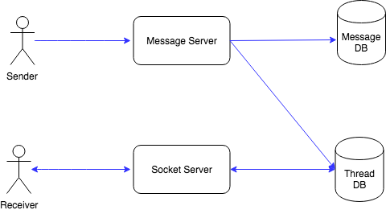

WhatsApp is a instant messaging service allows users to send text messages to each other through Web and Mobile interface.

## Requirement

#### Functional Requirement
1. Send and Receive message
2. Chat history storage.
3. Group chating.
4. Online status.
5. Login and read contacts.
6. Multiple devices support.

#### Non-Functional Requirement
1. Read-time chatting.
2. High Reliable. No chat history/message lose.
3. High Availability.

## Analysis

#### Total Users & DAU
Total Users: 1B  
Daily Active User: 100M  

#### Write/Read TPS
Total messages wrote: 100M * 10 = 1B  
Write TPS: 1B / 86400 = 10K TPS

#### Storage
Assume 1 message is 30 bytes, total size one day:

1B * 30 bytes = 30 GB/day

#### Network
1B * 30 bytes / 86400 = 300 Kbps

#### Cache

## API Design

## Database Design

Message Table
```
PK  | msg_id:int
    | thread_id:int
    | from_user_id:int
    | to_user_id:int
    | content:varchar(300)
    | create_time:datetime
```

Thread Table
```
PK  | thread_id:int
    | owner_id:int
    | participant_ids:text
    | nickname: string
    | create_time:datetime
    | update_time:datetime
```

Message Table could be stored in NoSQL, as the message is mainly for read, and don't need update.

Thread Table use MySQL. We could index by 
* `owner_id + thread_id` (primary key which could be used for searching).
* `owner_id + updated_time` (make the thread order by update time descending.
NoSQL doesn't have good support for secondary index.


## High Level Design

The basic idea for high level design.

Send Message:
* Client send a message to server
* Server creates a message in Message Table.
* Server creates one thread for all participant in the Thread Table (include sender and receivers)

Receive Message:
* Client poll threads from `socket server` every 10 seconds.
* If there is new threads, send a notification to user.



## Detailed Design

In the High Level Design, we are letting client to poll message every 10 seconds, it's not a real-time communication, and could have as most as 10 seconds delay. It's better to build a long-running Socket Connection between client and Socket Server. Whenever message server receives a message, it will find the Socket Server which is responsible for the thread of the receiver, and pass message to receiver through the long-running socket connection.

#### How to maintain the long-running socket connection between client and Socket Server?
If a socket connection has been inactive for 10 minutes, we interrupt the connection. If the socket connection is interrupted, and if there is a new message comes in, socket server builds a new socket connection to client.

#### What's the main difference betwen a Socket Connection and HTTP request?
* HTTP request could only be client send request to server, and server response back. (Pull message)
* Socket connection is long-running, and server could send the message back to client on it's own initiative. (Push message)

#### How to do group chat? Using a Channel Service.

If sending a message in a group of 500 people, only 10 people are online, with the existing architecture, we will do 500 query in Hash Ring, and message server will connect to 500 socket server. But only 10 socket server has active socket connection. 490 of the communication is waste.

Solution is to add a Channel Service. Channel Service is like a subscribe service of the threads of the group. When customer is online, it will first subscribe in the Channel Service in order to be able to receive the message to be pushed.

When sender sends a message in the group, it will first connect to Channel Service, and then Channel Service push to the Socket Server that subcribes the channel.

We could just store the channel subscriber information in the memory of channel service. It's like a cache. If it is crashed, we could just rebuild it using the information in the socket servers.

#### How to scale up the socket servers?

Using Consistent Hash Ring by hashing the user_id. Each online user are assigned to one Socket Server in the ring based on the `hash_base64(user_id)` to get the hash partition, and get the socket server that this user socket connection belongs to.

User ID is stored in User Table.

#### How to maintain the online status of users? Using heartbeat.

So we are making the Socket Connection session to be 10 minutes life. How to track that customer is not active after 10 minutes? Using client to send heartbeat to server every 5 seconds. If the socket server has not received the heartbeat for more than 10 minutes, then interrupt the socket connection.

For a message sender, its client will pull the status of the friends from it's message server every 5 seconds.

#### Building Connection Path

```
Client -> Message Server (HTTP Server> -> Channel Service -> Socket Server (return the IP of the socket server to client).

Then client use the IP to build socket connection to the socket server.
```

#### Send Message Path

```
Client A send a text message to Message Server -> Message Server insert the messsage to the Message Table -> Message Server insert a new thread to all participants in the thread table (if there is no existing threads) -> Message Server send to Channel Service if it's group chatting or Supplier Service if it's single person chatting -> Channel Service or Supplier Service will forward the message to the Socket Server -> Socket Server will build Socket Conneciton if the connection doesn't exist -> Send message to client.
```
