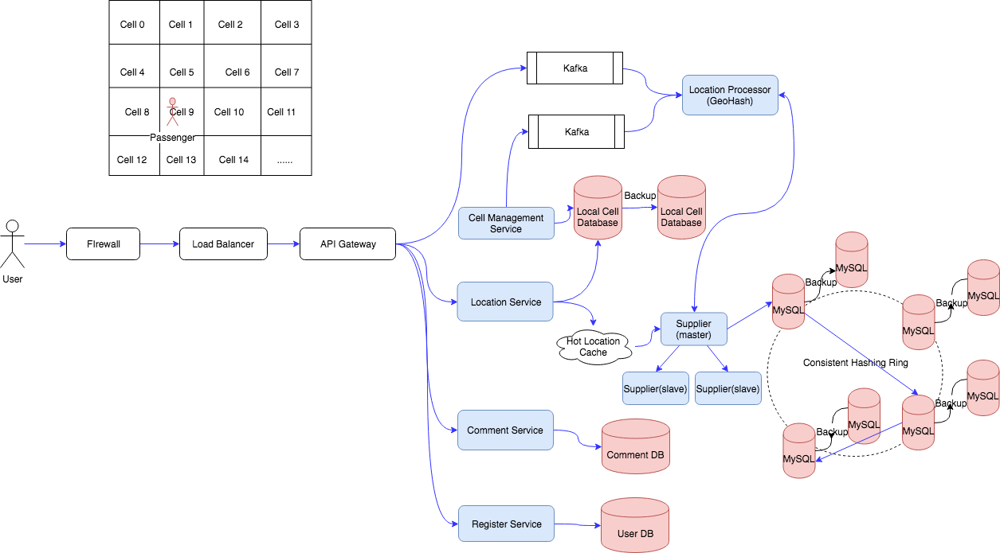

## Requirement

#### Functional Requirement
1. User should be able to add/delete/update Places.
2. Given a location (longitude/latitude), users should be able to find all nearby places within a given radius.
3. Users should be able to add feedback/review about a place.

#### Non-Functional Requirement
1. Performance. Real-time location search with low latency.
2. High Reliable. No data lose.
3. High Availability. Low down time.

## Analysis

#### Total Users & DAU & Total Locations

Total Users: 500M  
DAU: 100M  
Total Locations:  500M

#### Write TPS

Assume 1% of DAU will add new locations, total Write in the service per day:  
100M * 1% = 1M  
Write TPS: 1M / 86400 = 10 TPS

#### Read TPS
Each User Query one time per day:

Total queries one day: 100M * 1 = 100M  
Read TPS: 100M / 86400 = 1K TPS

#### Storage


#### Network

#### Cache

## API Design

```
search(user_id, key_words, longitude, latitude, radius_filter, category_filter, maximum_result_returned, sort)
```

```
write(user_id, loc_name, longitude, latitude, category, description)
```

```
comment(user_id, loc_id, comments, stars)
```

## Database Design

Location Table
```
PK  | loc_id:varchar(8)
    | loc_name:varchar(30)
    | longitude:varchar(8)
    | latitude:varchar(8)
    | geo_hash:varchar(12)
    | grid_id: varchar(8)
    | description:string
    | category:string
    | create_time:datetime
```

Each entity in the location table is: 100 bytes. Searching in a Location Table

```
SELECT * from LOC_TABLE
WHERE
    latitude >= curr_latitude - D AND
    latitude <= curr_latitude + D AND
    longitude >= curr_longitude - D AND
    longitude <= curr_longitude + D;
```

Comment Table
```
PK  | comment_id:varcharr(8)
FK  | loc_id:varchar(8)
FK  | user_id:int
    | comment:string
    | rating:int
    | create_time:datetime
```

Size of one row: 300

User Table
```
PK  | user_id:int
    | user_name:varchar(8)
    | create_time:datetime
```

## High Level Design


## Detailed Design
#### Grids
We can divide the map into smaller grids to group location into smaller sets. Each grid will store all the places residing within a specific range of lontitude and latitude. This scheme would enable us to query only a few grids to find nearby places. Based on a given location and radius, we can find all the neighboring gridds and then query these grids to find nearby locations (places).


#### How to scale up the Location Table? Using GeoHash to encode location, and using Cells to split the load as partitioning, and using Consistent Hash Ring to sharding the database servers.

Use GeoHash Library to hash the location [longitude, latitude] to a 12 bytes string. It's using Base32 encoding algorithm to encode the location. Example, `Example: (-30.043800, -51.140220) → 6feth68y4tb0`.

With the GeoHash, we could find that the closer the two locations, the longer the two geo hash will have in common prefix. For example:

```
LinkedIn HQ: 9q9hu3hhsjxx  
Google HQ: 9q9hvu7wbq2s  
Facebook HQ: 9q9j45zvr0se  
```

"9q9" is the common prefix.

With GeoHash, we could map location to cells. We can create a Consistent Hash Ring, and do GeoHash to the Cell (using the center point location), map the cell's GeoHash to one point in the ring, and create a MySQL Server to that cell to store the Location Table in the cell.

We have another dedicated Cell Table, which stores the GeoHash of the Cells in this area.

```
PK  | cell_id: varchar(12)
    | cell_name: varchar(30)
```

So when I am in a location, I can just search using the prefix of my location's GeoHash code:

[longitude, latitude] -> GeoHash

Create Index to the GeoHash field in the Location Table, 

```
CREATE INDEX on getohash;
```

Using LIKE query:

```
SELECT * FROM cell 
WHERE 
geohash LIKE '9q9hv%';
```

We will get a small list of cells, and it's cell_id, which is also GeoHash. Using these cell_ids, we could go to the Consistent Hashing Ring, do the dedicated MySQL servers, and do the below LIKE query:

```
SELECT * FROM location
WHERE
geohash LIKE '9q9hv%';
```

and return return the list of result to location service, and merge and rank, and then return to customer.



#### Write Path

#### Read Path
