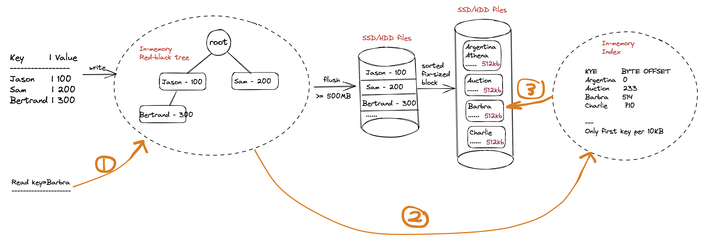

# LSM Tree Design

Design a KV Store

* LSM is used by BigTable, RocksDB, Cassandra, ...
* Cannot fit into memory, need to store on disk
* Write intensive, read light
* Range query

High Level Design

memtable + index + SSTable on disk (sorted string tables)

* What if key does not exist? Use bloom filters O(1).
    * NO (not present)
    * YES (may or may not present)

